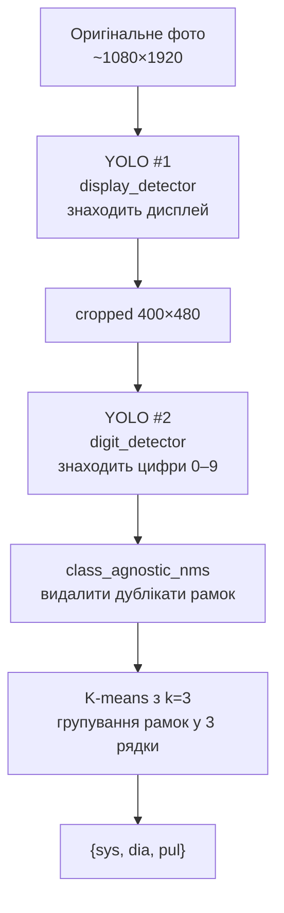
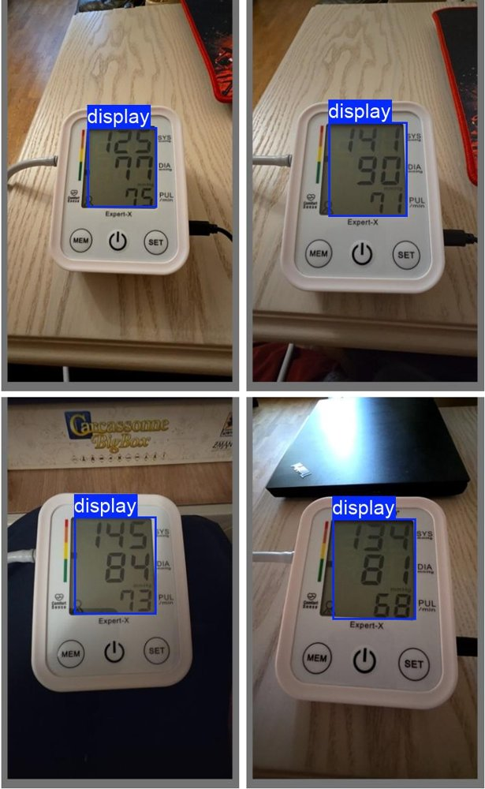
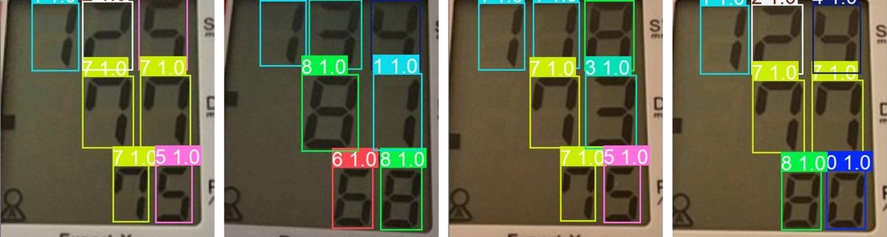

[English README](README.md)

# bp-ocr-cnn


Інструмент для розробки і тренування ML-моделей розпізнавання цифр з LCD-дисплея тонометра **Paramed Expert-X**. Готові моделі копіюються в [aivm-photo-api](https://github.com/Alexsik76/aivm-photo-api) для використання у продакшні.

## Що це робить

Бере фото тонометра, повертає JSON з показниками тиску:

```
20260516_044548.jpg  →  {"sys": 125, "dia": 74, "pul": 73}
```

End-to-end перевірка: **42/42 фото розпізнано коректно**. Зверніть увагу, що ці 42 фото також є навчальним набором — датасет занадто малий для окремого тестового набору. Цей показник демонструє, що пайплайн працює від початку до кінця, а не те, як модель узагальнюється на нових пристроях. Час інференсу: **~50 мс на CPU** (Ryzen 7 5700X3D).

## Архітектура пайплайну

Двостадійний YOLOv8:



**Чому два YOLO замість одного:** простіше тренувати і дебажити, легше донавчати окремо. Перший майже не потребує перетренування (дисплей завжди виглядає однаково), другий донавчається при поповненні датасету.

**Чому YOLOv8 nano:** ~50 мс на повний пайплайн на CPU. Обидві моделі разом ~12 МБ — комфортно версіонувати в git.

## Скріншоти

### Етап 1 — виявлення дисплея



Детектор першого етапу знаходить екран тонометра на повному фото.
Приклади показують різне освітлення, кути камери та фон.

### Етап 2 — розпізнавання цифр



Детектор другого етапу зчитує кожну цифру на вирізаному дисплеї.
Кожна рамка показує передбачений клас та рівень впевненості.

## Результати

| Модель | Precision | Recall | mAP50 | mAP50-95 | Епохи |
|---|---|---|---|---|---|
| Детектор дисплея | 0.990 | 1.000 | 0.995 | 0.946 | 100 |
| Детектор цифр | 0.992 | 1.000 | 0.995 | 0.856 | 37 |

Ці показники отримані на невеликому та однорідному датасеті: фото однієї моделі пристрою, зроблені в приміщенні однією людиною. Ці цифри показують, що задача є вузькою, а не те, що моделі є універсальними. Для іншого пристрою або ширшого діапазону умов знадобляться нові дані для навчання.

## Структура проєкту

```
bp-ocr-cnn/
├── cropped/                # cropped дисплеї 400×480 (вихід YOLO #1)
├── docs/
│   ├── img/                # скріншоти для документації
│   │   ├── detector_conditions.jpg
│   │   └── digit_recognition.jpg
│   └── bp-ocr-cnn_PLAN.md  # план проєкту
├── img_test/               # тестова фотографія з ground truth
├── labels/
│   ├── labels1/            # YOLO-розмітка дисплея (1 клас)
│   └── labels5/            # YOLO-розмітка цифр (10 класів), актуальна порція
├── latest_models/          # експортовані ONNX-моделі
├── runs/detect/
│   ├── display_detector_v1/weights/
│   │   ├── best.pt         # модель дисплея (стабільна)
│   │   ├── best.onnx       # fp32 ONNX
│   │   └── best_int8.onnx  # динамічна int8
│   ├── digit_detector_latest/weights/
│   │   ├── best.pt         # активна модель цифр
│   │   ├── best.onnx       # fp32 ONNX
│   │   └── best_int8.onnx  # динамічна int8
│   └── digit_detector_bak/weights/
│       └── best.pt         # попередня версія (страховка)
├── export_onnx.py
├── infer_yolo.py
├── prepare_dataset.py
├── prepare_dataset_digits.py
├── pyproject.toml
├── quantize.py
├── recognize_digits.py
├── requirements.txt
├── train_yolo.py
├── train_yolo_digits.py
├── validate_pipeline.py
├── verify_labels.py
├── README-UKR.md
└── README.md
```

## Каталог скриптів

| Скрипт | Призначення |
|---|---|
| `prepare_dataset.py` | Готує датасет з 1 класу (дисплей) для YOLO #1 |
| `train_yolo.py` | Тренує YOLO #1 |
| `infer_yolo.py` | Прогонить YOLO #1, нарізає вхідні фото у `cropped/` |
| `prepare_dataset_digits.py` | Готує датасет з 10 класів (цифри 0-9) для YOLO #2 |
| `train_yolo_digits.py` | Тренує YOLO #2 з ротацією latest/bak |
| `verify_labels.py` | Звіряє розмітку YOLO з ground truth з .json |
| `recognize_digits.py` | Інференс YOLO #2 + збірка JSON на одному cropped |
| `validate_pipeline.py` | End-to-end на всіх фото з вказаної папки (`img_test/` для швидкої перевірки), порівняння з ground truth; підтримує `--backend pt\|onnx\|int8\|int8-display` |
| `export_onnx.py` | Експортує `.pt` → `.onnx` (fp32, opset 17) для обох моделей |
| `quantize.py` | Квантизує `.onnx` → `_int8.onnx` (динамічна weight-only int8) |

## Локальна розробка

Зверніть увагу, що папка `img/` містить особисті фотографії автора і не комітиться у Git; папка `img_test/` містить тестову фотографію з ground truth для перевірки роботи пайплайну після клонування.

Створення середовища та встановлення залежностей:

```bash
python -m venv venv

# Linux/macOS:
source venv/bin/activate
# Windows:
.\venv\Scripts\Activate.ps1

pip install -r requirements.txt
```

Команди для запуску:

```bash
# Перевірити поточну модель на тестовому фото (PyTorch)
python validate_pipeline.py img_test

# Перевірити ONNX fp32
python validate_pipeline.py img_test --backend onnx

# Перевірити int8 (браузерний варіант)
python validate_pipeline.py img_test --backend int8

# Оновити ONNX після перетренування
python export_onnx.py && python quantize.py
```

Потрібно: Python 3.12+, PyTorch (CPU достатньо), ultralytics, onnx, onnxruntime. Залежності в `requirements.txt`.

## Як це працює — повний цикл розробки

### Початкове тренування (зроблено один раз)

1. Зібрано 42 фото тонометра з ручним записом справжніх значень у `.json`.
2. Розмічено дисплей на всіх 42 фото (`labels/labels1/`) → натреновано YOLO #1.
3. Прогнано `infer_yolo.py` → отримано 42 cropped дисплея.
4. Розмічено цифри на 20 з 42 фото (`labels/labels5/`) → натреновано YOLO #2.
5. End-to-end перевірка: 42/42 фото розпізнано коректно.

### Донавчання при появі нових фото

Через aivm-photo-api на NAS поступово накопичуються нові фото від реальних користувачів. При +N нових (де N — рішення на конкретний момент, орієнтовно 20-50):

```bash
# Linux/macOS:
source venv/bin/activate
# Windows:
.\venv\Scripts\Activate.ps1

# 1. Скопіювати нові фото з NAS у img/
# (нові .jpg + .json пари, сумісні з форматом aivm-photo-api)

# 2. Нарізати cropped через YOLO #1
python infer_yolo.py img

# 3. Розмітити нові cropped через https://www.makesense.ai/
#    Зберегти в labels/labelsN/ (нова порція, не перезаписувати попередню)

# 4. Перевірити розмітку через ground truth
python verify_labels.py cropped labels/labelsN img

# 5. Перепідготувати датасет
python prepare_dataset_digits.py cropped labels/labelsN dataset_digits

# 6. Тренування — автоматично ротує latest → bak
python train_yolo_digits.py

# 7. Валідація на всіх фото
python validate_pipeline.py img

# 8. Якщо нова модель краща за bak — скопіювати best.pt у aivm-photo-api,
#    redeploy контейнера. Інакше — повернутись до bak.
```

## ONNX-експорт і квантизація

Моделі експортовані у ONNX для використання в браузері (onnxruntime-web) — частина плану перенесення OCR на клієнтську сторону.

### Перевірка точності ONNX (42 навчальних фото)

| Backend | End-to-end перевірка | display_detector | digit_detector | Загальний розмір |
|---|---|---|---|---|
| PyTorch `.pt` | 42/42 (100%) | ~6 MB | ~6 MB | ~12 MB |
| ONNX fp32 | 42/42 (100%) | 11.7 MB | 11.6 MB | 23.3 MB |
| ONNX int8 | 42/42 (100%) | 3.2 MB | 3.1 MB | **6.3 MB** |

Квантизація — динамічна (weight-only), без калібрувального датасету. Точність не зменшується на 42 навчальних фото; при появі нових фото — перевіряти повторно.

### Як оновити ONNX-файли після перетренування

```bash
# Linux/macOS:
source venv/bin/activate
# Windows:
.\venv\Scripts\Activate.ps1

# Після train_yolo_digits.py (або train_yolo.py):
python export_onnx.py       # best.pt -> best.onnx
python quantize.py          # best.onnx -> best_int8.onnx

# Перевірити що точність не впала
python validate_pipeline.py img --backend int8
```

### Опції `--backend` у `validate_pipeline.py`

| Опція | Моделі |
|---|---|
| `pt` | обидві `.pt` (за замовчуванням) |
| `onnx` | обидві fp32 `.onnx` |
| `int8` | обидві `_int8.onnx` |
| `int8-display` | display int8 + digit fp32 (для тестування ізольовано) |

## Процедура розмітки

**Сайт:** https://www.makesense.ai/

1. Get Started → перетягнути фото з `cropped/` (з `cropped`, не з `img` — там цифри більші, зручніше).
2. Select Object Detection.
3. Створити 10 класів `0`, `1`, `2`, … `9` **рівно в такому порядку** (важливо: class id має збігатись з цифрою).
4. Розмітка кожного фото:
   - Прямокутник навколо кожної цифри окремо.
   - **Рамка = "слот"**, не контур цифри. Висота і ширина рамок у межах одного рядка однакові для всіх цифр — `1` має таку саму рамку як `8`.
   - НЕ розмічати: `mmHg`, `SYS/DIA/PUL`, іконки, кольорову смугу, `Expert-X`.
   - SYS — верхній рядок (3 цифри), DIA — середній (2), PUL — нижній (2).
5. Actions → Export Annotations → "A .zip package containing files in YOLO format".
6. Розпакувати у `labels/labelsN/` (нова папка для кожної ітерації, попередні не перезаписувати).

## Архітектурні рішення

- **Розмітка "слотами":** модель навчається структури семисегмента, а не контуру цифри. Так точніше розпізнаються вузькі цифри (`1`, `7`) поряд із широкими (`8`).
- **Без flip/rotate у YOLO #2:** `2↔5` дзеркальні, `6↔9` перевернуті. Аугментація поворотом — лише ±10° для YOLO #1 (бо камера тримається з нахилом), для YOLO #2 — без поворотів узагалі.
- **Class-agnostic NMS:** видаляє дублікати рамок які YOLO може лишити, бо вважає їх різними класами (наприклад `2` і `3` на одній позиції). Звичайний NMS YOLO не видаляє такі пари.
- **K-means замість gap-detection:** гарантовано 3 рядки навіть при близьких Y-координатах. Жадібний gap-detection ламався на фото під кутом.
- **digit_detector_bak/:** після кожного тренування попередня модель не видаляється, а перейменовується. Якщо нова виявилась гіршою — повернутися до попередньої одним перейменовуванням.

## Інтерпретація типових помилок

| Тип | Симптом | Причина | Лікується |
|---|---|---|---|
| 1 | `1233/78/77` | YOLO дає 2 рамки на одну цифру | NMS (виправлено) |
| 2 | `13/77/73` | Пропущена цифра | Більше даних |
| 3 | `137/79/73` замість `137/79/78` | Плутає класи (наприклад `8↔3`) | Більше даних |
| 4 | `got 2 rows, need 3` | Gap-detection помилився | K-means (виправлено) |

## Що НЕ робити

- Не міняти структуру `cropped/` — це вхід для YOLO #2 і пов'язана розмітка.
- Не передавати фото з `cropped/` повторно через YOLO #1.
- Не тренувати YOLO #2 з flip-аугментацією.
- Не плутати папки `labels1` (дисплей) і `labels5` (цифри) — це різні задачі.
- Не видаляти `digit_detector_bak/` — це страховка від невдалого тренування.

## Зв'язок з іншими частинами системи

- **aivm-photo-api** — споживач готових моделей. При деплої нової моделі копіюється в [aivm-photo-api](https://github.com/Alexsik76/aivm-photo-api), контейнер перебудовується.
- **[bptracker-backend-fastapi](https://github.com/Alexsik76/bptracker-backend-fastapi)** — викликає aivm-photo-api для розпізнавання, отримує JSON.
- **План проєкту** — див. [bp-ocr-cnn_PLAN.md](docs/bp-ocr-cnn_PLAN.md) щодо плану дій.

## Подальші плани

Див. [bp-ocr-cnn_PLAN.md](docs/bp-ocr-cnn_PLAN.md) — задачі по тренуванню, дорозмітці, експериментам з моделлю.
