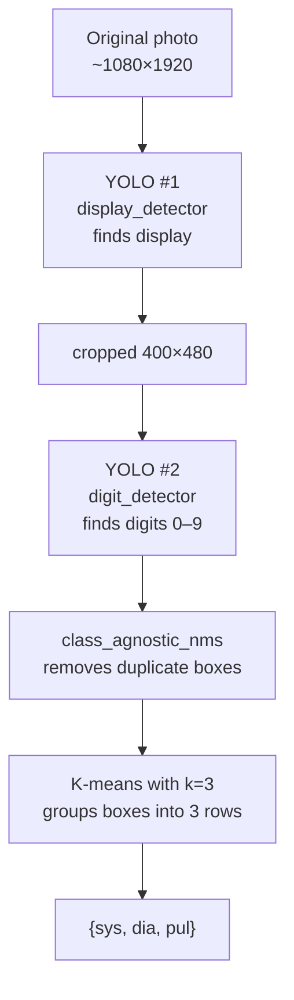

[README українською](README-UKR.md)

# bp-ocr-cnn

Tool for training and developing ML models to recognize digits from the LCD display of the **Paramed Expert-X** blood pressure monitor. Ready-to-use models are copied to [aivm-photo-api](https://github.com/Alexsik76/aivm-photo-api) for production deployment.

## What it does

Takes a photo of a blood pressure monitor and returns a JSON object with blood pressure values:

```
20260516_044548.jpg  →  {"sys": 125, "dia": 74, "pul": 73}
```

Accuracy on the test set: **42/42 (100%)**, inference speed: **~50 ms on CPU** (Ryzen 7 5700X3D).

## Pipeline Architecture

Two-stage YOLOv8:



**Why two YOLO models instead of one:** Easier to train and debug, and simpler to retrain independently. The first model rarely needs retraining (the display layout stays consistent), while the second model can be retrained as new dataset photos arrive.

**Why YOLOv8 nano:** ~50 ms for the entire pipeline on CPU. Both models combined are ~12 MB — easy to version control in Git.

## Project Structure

```
bp-ocr-cnn/
├── venv/
├── img/                    # original .jpg + .json (ground truth)
├── cropped/                # cropped displays 400×480 (YOLO #1 output)
├── labels/
│   ├── labels1/            # YOLO display labels (1 class)
│   └── labels3/            # YOLO digit labels (10 classes), active batch
├── dataset/                # prepared dataset for YOLO #1
├── dataset_digits/         # prepared dataset for YOLO #2
├── runs/detect/
│   ├── display_detector_v1/weights/
│   │   ├── best.pt         # display model (stable)
│   │   ├── best.onnx       # fp32 ONNX (11.7 MB)
│   │   └── best_int8.onnx  # dynamic int8 (3.2 MB)
│   ├── digit_detector_latest/weights/
│   │   ├── best.pt         # active digit model
│   │   ├── best.onnx       # fp32 ONNX (11.6 MB)
│   │   └── best_int8.onnx  # dynamic int8 (3.1 MB)
│   └── digit_detector_bak/weights/best.pt     # previous version (backup)
├── prepare_dataset.py
├── prepare_dataset_digits.py
├── train_yolo.py
├── train_yolo_digits.py
├── infer_yolo.py
├── verify_labels.py
├── recognize_digits.py
├── validate_pipeline.py
├── export_onnx.py
├── quantize.py
├── requirements.txt
├── PLAN.md
└── README.md
```

## Scripts Directory

| Script | Purpose |
|---|---|
| `prepare_dataset.py` | Prepares dataset for 1 class (display) for YOLO #1 |
| `train_yolo.py` | Trains YOLO #1 |
| `infer_yolo.py` | Runs YOLO #1, crops input photos into `cropped/` |
| `prepare_dataset_digits.py` | Prepares dataset for 10 classes (digits 0-9) for YOLO #2 |
| `train_yolo_digits.py` | Trains YOLO #2 with latest/bak rotation |
| `verify_labels.py` | Compares YOLO labels with ground truth from .json |
| `recognize_digits.py` | YOLO #2 inference + JSON assembly on a single cropped photo |
| `validate_pipeline.py` | End-to-end evaluation on all photos in `img/`, comparing with ground truth; supports `--backend pt\|onnx\|int8\|int8-display` |
| `export_onnx.py` | Exports `.pt` → `.onnx` (fp32, opset 17) for both models |
| `quantize.py` | Quantizes `.onnx` → `_int8.onnx` (dynamic weight-only int8) |

## How It Works — Full Development Cycle

### Initial Training (Done once)

1. Collected 42 monitor photos with manually recorded real values in `.json`.
2. Labeled display bounding boxes on all 42 photos (`labels/labels1/`) → trained YOLO #1.
3. Ran `infer_yolo.py` → produced 42 cropped display images.
4. Labeled digits on 20 out of 42 photos (`labels/labels3/`) → trained YOLO #2.
5. End-to-end check: 100% accuracy on all 42 photos.

### Retraining on New Photos

New photos from real users accumulate on the NAS via `aivm-photo-api`. When +N new photos are available (where N is usually 20–50):

```bash
cd D:\dev\bp_tracker\bp-ocr-cnn
.\venv\Scripts\Activate.ps1

# 1. Copy new photos from NAS into img/
# (new .jpg + .json pairs compatible with aivm-photo-api format)

# 2. Crop displays via YOLO #1
python infer_yolo.py img

# 3. Label new cropped images using https://www.makesense.ai/
#    Save into labels/labelsN/ (new batch, do not overwrite previous)

# 4. Verify labels against ground truth
python verify_labels.py cropped labels\labelsN img

# 5. Re-prepare the dataset
python prepare_dataset_digits.py cropped labels\labelsN dataset_digits

# 6. Training — automatically rotates latest → bak
python train_yolo_digits.py

# 7. Validate on all photos
python validate_pipeline.py img

# 8. If the new model is better than bak — copy best.pt to aivm-photo-api,
#    redeploy the container. Otherwise — revert to bak.
```

## ONNX Export and Quantization

Models are exported to ONNX format for browser execution via `onnxruntime-web` — part of moving OCR processing to the client side.

### Benchmark Dataset Accuracy (42 photos)

| Backend | Accuracy | display_detector | digit_detector | Total |
|---|---|---|---|---|
| PyTorch `.pt` | 42/42 (100%) | ~6 MB | ~6 MB | ~12 MB |
| ONNX fp32 | 42/42 (100%) | 11.7 MB | 11.6 MB | 23.3 MB |
| ONNX int8 | 42/42 (100%) | 3.2 MB | 3.1 MB | **6.3 MB** |

Quantization is dynamic (weight-only), requiring no calibration dataset. Accuracy does not drop on the current test set; verify again whenever new photos are added.

### How to Update ONNX Files After Retraining

```bash
cd D:\dev\bp_tracker\bp-ocr-cnn
.\venv\Scripts\Activate.ps1

# After train_yolo_digits.py (or train_yolo.py):
python export_onnx.py       # best.pt -> best.onnx
python quantize.py          # best.onnx -> best_int8.onnx

# Verify that accuracy did not decrease
python validate_pipeline.py img --backend int8
```

### `--backend` Options in `validate_pipeline.py`

| Option | Models |
|---|---|
| `pt` | both `.pt` (default) |
| `onnx` | both fp32 `.onnx` |
| `int8` | both `_int8.onnx` |
| `int8-display` | display int8 + digit fp32 (for isolated testing) |

## Labeling Procedure

**Website:** https://www.makesense.ai/

1. Get Started → drag and drop photos from `cropped/` (from `cropped`, not `img` — digits are larger and easier to select).
2. Select Object Detection.
3. Create 10 classes: `0`, `1`, `2`, … `9` **in this exact order** (important: class ID must match the digit).
4. Labeling each photo:
   - Draw a bounding box around each digit individually.
   - **Box = "slot"**, not digit contour. Box width and height within the same row should be equal for all digits — `1` uses the same box dimensions as `8`.
   - DO NOT label: `mmHg`, `SYS/DIA/PUL`, icons, color bars, `Expert-X`.
   - SYS — top row (3 digits), DIA — middle row (2), PUL — bottom row (2).
5. Actions → Export Annotations → "A .zip package containing files in YOLO format".
6. Extract into `labels/labelsN/` (create a new folder for each batch, do not overwrite previous ones).

## Architectural Decisions

- **"Slot" Labeling:** The model learns seven-segment digit positions rather than tight contours. This improves detection accuracy for narrow digits (`1`, `7`) next to wide digits (`8`).
- **No Flip/Rotate in YOLO #2:** `2↔5` are mirrored, `6↔9` are inverted. Rotation augmentation is set to ±10° for YOLO #1 only (since cameras may be slightly tilted); YOLO #2 uses no rotations.
- **Class-agnostic NMS:** Removes duplicate overlapping bounding boxes that YOLO might produce when predicting different classes for the same location (e.g., `2` and `3`). Standard YOLO NMS does not remove such pairs.
- **K-means instead of Gap-detection:** Guarantees 3 rows even when Y-coordinates are close. Greedy gap-detection failed on tilted images.
- **digit_detector_bak/:** After each training run, the previous model is renamed rather than deleted. If the new model performs worse, you can revert by renaming it back.

## Common Errors & Troubleshooting

| Type | Symptom | Cause | Solution |
|---|---|---|---|
| 1 | `1233/78/77` | YOLO detects 2 boxes for one digit | NMS (fixed) |
| 2 | `13/77/73` | Missing digit | Add more data |
| 3 | `137/79/73` instead of `137/79/78` | Class confusion (e.g. `8↔3`) | Add more data |
| 4 | `got 2 rows, need 3` | Gap-detection error | K-means (fixed) |

## What NOT to Do

- Do not modify the `cropped/` structure — it serves as input for YOLO #2 and associated labels.
- Do not pass images from `cropped/` through YOLO #1 again.
- Do not train YOLO #2 with flip augmentation.
- Do not mix `labels1` (display) and `labels3+` (digits) folders — they represent different tasks.
- Do not delete `digit_detector_bak/` — it serves as a safety fallback.

## Local Development

```bash
cd D:\dev\bp_tracker\bp-ocr-cnn
.\venv\Scripts\Activate.ps1

# Check current model performance on all photos (PyTorch)
python validate_pipeline.py img

# Check ONNX fp32
python validate_pipeline.py img --backend onnx

# Check int8 (browser version)
python validate_pipeline.py img --backend int8

# Update ONNX after retraining
python export_onnx.py && python quantize.py
```

Requirements: Python 3.12+, PyTorch (CPU is sufficient), ultralytics, onnx, onnxruntime. Dependencies are listed in `requirements.txt`.

## Integration with Other System Components

- **aivm-photo-api** — consumer of trained models. When deploying a new model, copy it to `../aivm-photo-api/models/` and rebuild the container.
- **bptracker-backend** — calls aivm-photo-api for recognition and receives JSON.
- **Root PLAN.md** (`../PLAN.md`) — overall project roadmap.

## Future Plans

See [PLAN.md](./PLAN.md) — tasks for model training, extra annotations, and architecture experiments.
